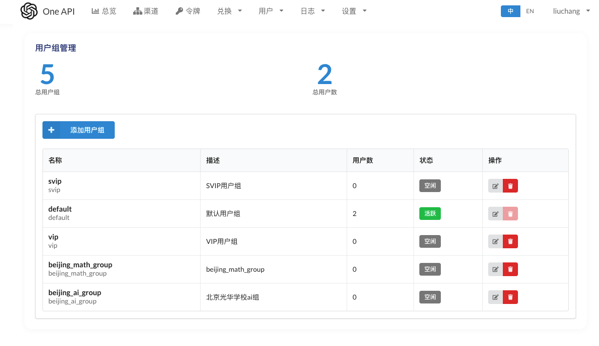
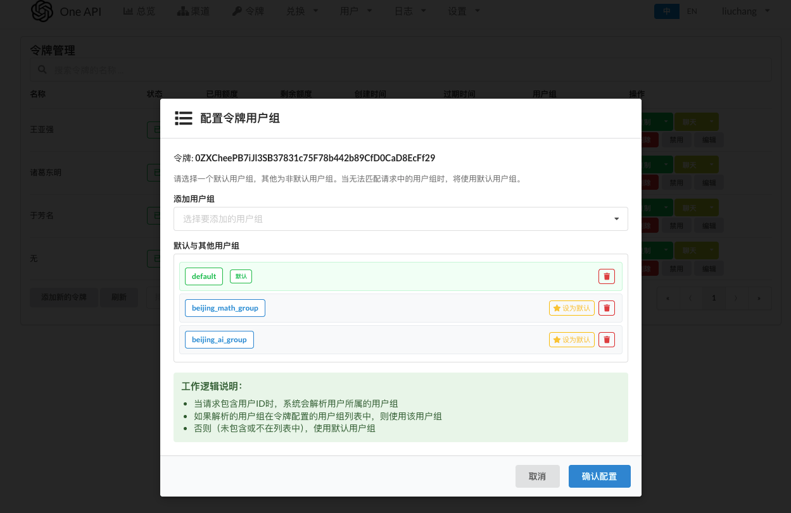
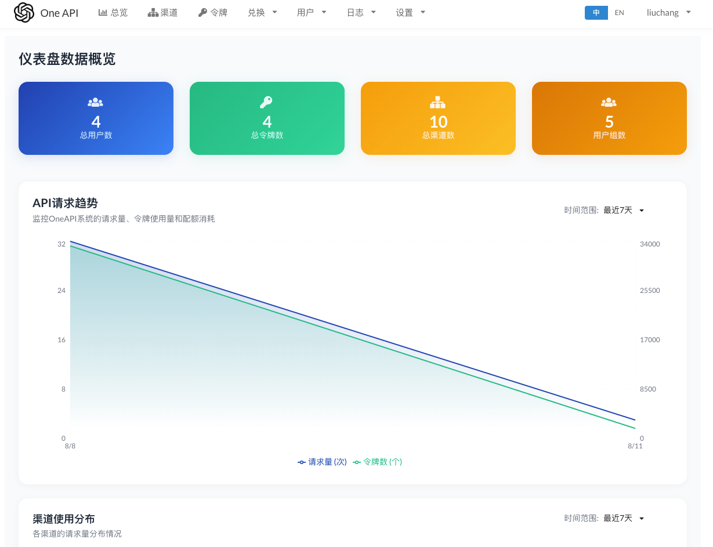
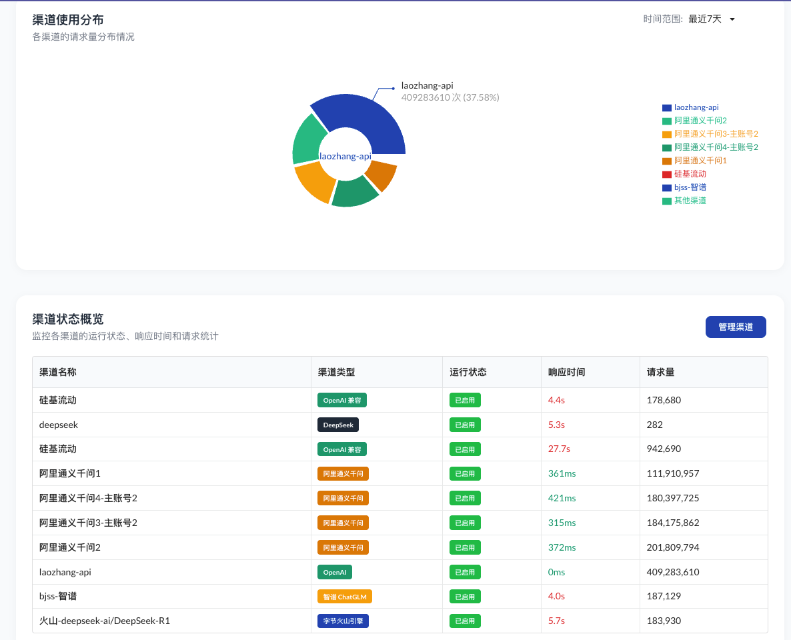
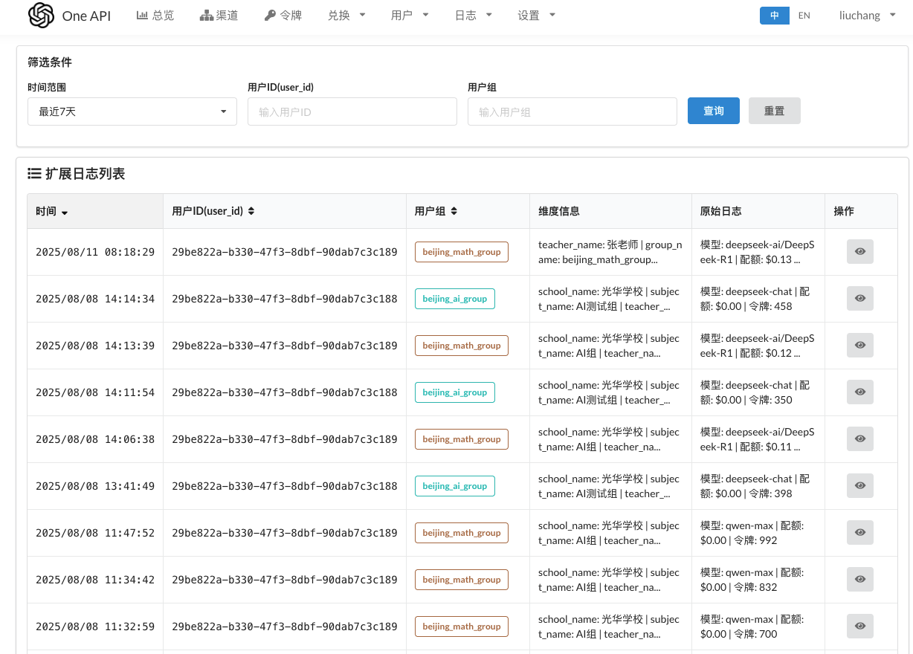
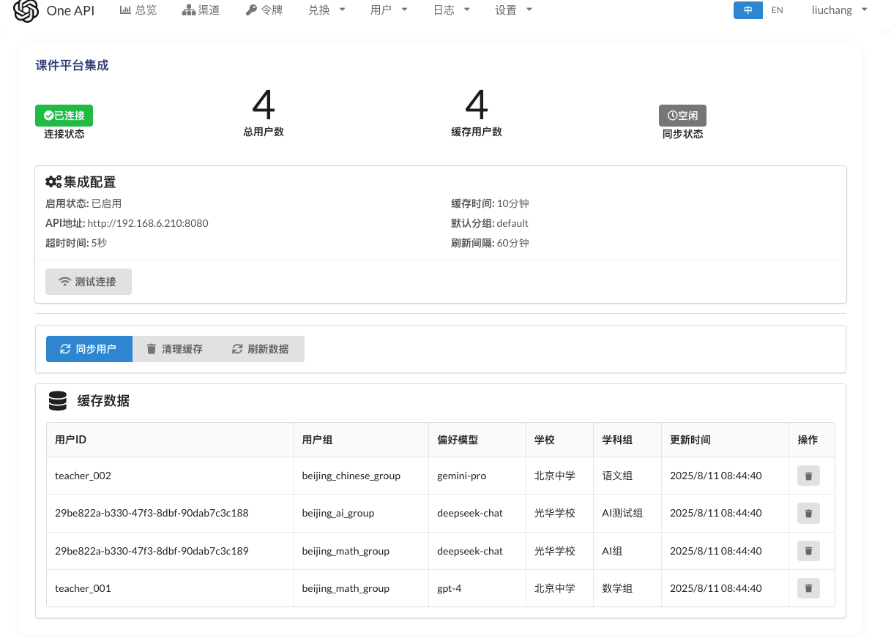

<p align="right"><strong>中文</strong></p>

<p align="center">
  <a href="https://github.com/songquanpeng/one-api"></a>
</p>

<div align="center">

# One API

_✨ 通过标准的 OpenAI API 格式访问所有的大模型，开箱即用 ✨_

</div>

# 概述

`oneapi` 是一个统一的 LLM 网关，采用 OpenAI 兼容的 API 格式，聚合多个模型提供商并提供令牌、分组、分发、日志等能力。

# 功能更新：
## v3.0 新增
- 用户组管理：支持对 `用户组` 的新增、修改、删除；
- 基于令牌与用户组的使用：令牌可配置多个 `用户组` ，调用时自动解析生效分组
- 智能模型选择：请求头 `X-Smart-Model-Selection: true` 时，结合 `X-User-ID` 与缓存的偏好模型替换请求模型

## 功能演示
- 用户组管理界面：

- 令牌配置用户组：在令牌详情中配置多个 `用户组`（含优先级）

- 总览页面：


- 扩展日志界面：记录 `external_user_id`、`user_group` 

- 课件平台集成：



## 部署方法
```bash
# 进入根目录

# 使用docker-compose 启动
docker-compose up -d

```


## 环境变量配置说明
在docker-compose.yml中，配置了课件平台集成相关的环境变量，请根据实际情况修改。

- `COURSEWARE_ENABLED=true`：启用课件平台集成
- `COURSEWARE_PLATFORM_BASE_URL`、`COURSEWARE_PLATFORM_API_KEY`：课件平台 API 配置
- `COURSEWARE_WEBHOOK_SECRET`：开启 `webhook` 签名校验（非空即生效）
- `COURSEWARE_CACHE_TTL=10m`、`COURSEWARE_REFRESH_INTERVAL=1h`、`COURSEWARE_PRELOAD_BATCH_SIZE=100`、`COURSEWARE_DEFAULT_GROUP=default`
- `REDIS_CONN_STRING` 与 `SYNC_FREQUENCY`：启用 Redis 与定期同步


## 系统架构


## Webhook 调用方法
- OneAPI 端点：
  - `POST /api/courseware/webhook/user`
  - `POST /api/courseware/webhook/users`
  - `DELETE /api/courseware/webhook/user/:teacher_id`
- Header：
  - `X-Webhook-Timestamp`: unix 秒
  - `X-Webhook-Signature`: `sha256=<hex(hmacSHA256(ts + "." + body, COURSEWARE_WEBHOOK_SECRET))>`
  - `X-Webhook-Event`: `courseware.user.upsert | courseware.users.batch_upsert | courseware.user.delete`
- `mock server`：
  - 前端页面提供 `/oneapi/webhook/*` 的调试入口，自动签名并转发；配置 `oneapi_base_url` 与 `oneapi_webhook_secret`

## 其他文档链接
- 需求文档：[需求文档](./docs/prd/需求文档.md)
- 实现方案：[实现方案](./docs/arch/实现方案v3.0版本.md)
- 开发计划：[开发计划](./docs/plan/开发计划v3.0版本.md)
- 测试用例说明：[测试用例说明](./tests/README.md)
- `mock server` 使用：[mock server 使用](./scripts/mock-server/README.md)

## 其他
> [!WARNING]
> 使用 root 用户初次登录系统后，务必修改默认密码 `123456`！
> 
- 本项目为开源项目，使用者必须在遵循 OpenAI 的[使用条款](https://openai.com/policies/terms-of-use)以及**法律法规**的情况下使用，不得用于非法用途。
- 根据[《生成式人工智能服务管理暂行办法》](http://www.cac.gov.cn/2023-07/13/c_1690898327029107.htm)的要求，请勿对中国地区公众提供一切未经备案的生成式人工智能服务。