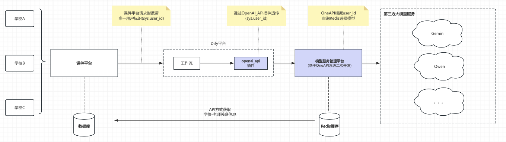

# OneAPI v3.0 上线部署方案

## 概述
本次针对课件平台的改造方案，主要涉及到`Dify平台的插件`、`OneAPI系统的更新`，所以更新部署主要分为两个部分进行。



备注：Dify平台的插件、OneAPI系统均考虑了向后兼容策略，所以两部分功能分批更新不影响原有功能使用。


## 第一部分：Dify平台安装透传插件
### 1.1 通过Github安装插件

在Dify平台中，选择`安装插件`-> `Github`-> 输入github仓库地址：

```bash
https://github.com/domonic18/dify-plugin-openai-api-compatble-enhanced
```

点击`安装`，选择`v0.0.1`版本后确定安装。


### 1.2 配置插件


| 配置项 | 示例 |
|--------|------|
| API Endpoint URL  | `http://192.168.6.188:3000/v1` |
| API Key  | `sk-xxx...` （在OneAPI系统中生成）|
| Model Name  | `deepseek-chat` |
| 启用sys变量透传 | `启用` |
| 要透传的sys变量列表 | `user_id` |
| 启用智能选择模型|`启用`|

### 1.3 使用插件
在Dify平台中，选择`工作流`-> `新建/选择已有工作流`-> 在工作流中选择LLM节点->选择`OpenAI API Compatible Enhanced`插件，更换为对应的模型即可。


### 1.4 回滚方案：
- `OpenAI API Compatible Enhanced`插件与`OpenAI API Compatible`插件不会相互影响。
- 如需回滚，在Dify平台中将工作流LLM节点更换回原`OpenAI API Compatible`插件即可。

---

## 第二部分：OneAPI系统的更新与部署

### 2.1 备份OneAPI系统原有数据
- 备份业务库（库名 `oneapi`）：
```bash
# 通过SSH链接至南京节点服务器：guanghua.hk33smarter.com
ssh ubuntu@guanghua.hk33smarter.com


# 临时关闭防火墙（允许所有流量）
# 设置默认策略为 ACCEPT
sudo iptables -P INPUT ACCEPT
sudo iptables -P OUTPUT ACCEPT
sudo iptables -P FORWARD ACCEPT

# 切换到项目目录
cd /home/ubuntu/projects/one-api

# 备份业务库（库名 `oneapi`）
# 推荐：交互式输入密码（安全），并关闭 GTID 导出以避免恢复告警
mysqldump -h 10.3.0.15 -P 3306 -u liuchang -p \
  --single-transaction --routines --triggers --events \
  --set-gtid-purged=OFF \
  oneapi > backup_oneapi_$(date +%F_%H%M).sql
```

### 2.2 拉取OneAPI系统最新代码
```bash
# 修改原有项目命名为one-api-old 
mv /home/ubuntu/projects/one-api /home/ubuntu/projects/one-api-old


# 首次部署（锁定指定分支）
git clone -b feature/model-management-system --single-branch \
  https://git.code.tencent.com/domonic/one-api.git

# 切换到项目目录
cd one-api

# 已有仓库切换到指定远端与分支
# git remote set-url origin https://git.code.tencent.com/domonic/one-api.git
# git fetch origin
# git checkout feature/model-management-system
# git pull --ff-only origin feature/model-management-system
```

### 2.3 数据库升级
- 若存在迁移脚本（例如 `bin/migration_v3.0.sql`），生产环境建议先执行：
```bash
# 切换到项目目录
cd /home/ubuntu/projects/one-api

# 交互式输入密码（推荐）并避免 GTID 影响（如需）
mysql -h 10.3.0.15 -P 3306 -u liuchang -p oneapi < bin/migration_v3.0.sql

# 或非交互式（使用环境变量，避免命令行明文密码）
# 注意：仅在 CI/自动化场景使用，shell 历史中不留痕
# export MYSQL_PWD='你的密码'
# mysql -h 10.3.0.15 -P 3306 -u liuchang oneapi < bin/migration_v3.0.sql
```

### 2.4 确认OneAPI的docker-compose.yml文件配置
#### 2.4.1 使用远程MySQL
- 使用远程 MySQL，修改 `docker-compose.yml` 的 `one-api.environment` 中的环境变量：
```yaml
services:
  one-api:
    environment:
      # - SQL_DSN=oneapi:123456@tcp(oneapi-mysql:3306)/oneapi?charset=utf8mb4&parseTime=True&loc=Local  # 修改此行，或注释掉以使用 SQLite 作为数据库
      - SQL_DSN=liuchang:{password}@tcp(10.3.0.15:3306)/oneapi?charset=utf8mb4&parseTime=True&loc=Local
```

备注：
- `{password}` 为MySQL的密码，请替换为实际密码。

#### 2.4.2 增加新的环境变量
- 增加新的环境变量，用于配置课件平台相关配置：
```yaml
services:
  one-api:
    environment:
      - SYNC_FREQUENCY=60  # 需要定期从数据库加载数据时取消注释该行
      - COURSEWARE_ENABLED=true                                    # 启用课件平台集成
      - COURSEWARE_PLATFORM_BASE_URL=https://courseware-api.bj33smarter.com   # 课件平台API地址
      - COURSEWARE_PLATFORM_API_KEY=courseware-api-key              # 课件平台API密钥
      - COURSEWARE_PLATFORM_TIMEOUT=5                              # API超时时间（秒）
      - COURSEWARE_CACHE_TTL=10m                                   # 缓存时间（可选）
      - COURSEWARE_REFRESH_INTERVAL=1h                             # 刷新间隔（可选）
      - COURSEWARE_PRELOAD_BATCH_SIZE=100                          # 预加载批次大小（可选）
      - COURSEWARE_DEFAULT_GROUP=default                           # 默认用户组（可选）
      - COURSEWARE_WEBHOOK_SECRET=dev_webhook_secret               # 课件平台webhook 密钥（可选）
```

#### 2.4.3 确认网络配置
- 确认 `docker-compose.yml` 中的网络配置，确保 `oneapi` 与 `dify` 可以互相通信。
```yaml
networks:
  backend:
    internal: true  # 仅用于 one-api、db、redis 之间的后端通信
  docker_default:
    external: true  # 声明这是一个外部网络
```

#### 2.4.4 完整地docker-compose.yml文件
```yaml
services:
  one-api:
    build:
      context: .
      dockerfile: Dockerfile
    container_name: one-api
    restart: always
    command: --log-dir /app/logs
    ports:
      - "3000:3000"
    volumes:
      - ./data/oneapi:/data
      - ./logs:/app/logs
    environment:
      # - SQL_DSN=oneapi:123456@tcp(oneapi-mysql:3306)/oneapi?charset=utf8mb4&parseTime=True&loc=Local  # 修改此行，或注释掉以使用 SQLite 作为数据库
      - SQL_DSN=liuchang:{password}@tcp(10.3.0.15:3306)/oneapi?charset=utf8mb4&parseTime=True&loc=Local
      - REDIS_CONN_STRING=redis://oneapi-redis:6379/0
      - SESSION_SECRET=random_string  # 修改为随机字符串
      - TZ=Asia/Shanghai
#      - NODE_TYPE=slave  # 多机部署时从节点取消注释该行
#      - FRONTEND_BASE_URL=https://openai.justsong.cn  # 多机部署时从节点取消注释该行
      - SYNC_FREQUENCY=60  # 需要定期从数据库加载数据时取消注释该行
      - COURSEWARE_ENABLED=true                                    # 启用课件平台集成
      - COURSEWARE_PLATFORM_BASE_URL=https://courseware-api.bj33smarter.com   # 课件平台API地址
      - COURSEWARE_PLATFORM_API_KEY=courseware-api-key              # 课件平台API密钥
      - COURSEWARE_PLATFORM_TIMEOUT=5                              # API超时时间（秒）
      - COURSEWARE_CACHE_TTL=10m                                   # 缓存时间（可选）
      - COURSEWARE_REFRESH_INTERVAL=1h                             # 刷新间隔（可选）
      - COURSEWARE_PRELOAD_BATCH_SIZE=100                          # 预加载批次大小（可选）
      - COURSEWARE_DEFAULT_GROUP=default                           # 默认用户组（可选）
      - COURSEWARE_WEBHOOK_SECRET=dev_webhook_secret               # 课件平台webhook 密钥（可选）
    networks:
      - backend
      - docker_default          # 设置与dify一个网络，从而实现dify的nginx可以路由转发请求至oneapi

    depends_on:
      - redis
      - db
    healthcheck:
      test: [ "CMD-SHELL", "wget -q -O - http://localhost:3000/api/status | grep -o '\"success\":\\s*true' | awk -F: '{print $2}'" ]
      interval: 30s
      timeout: 10s
      retries: 3

  redis:
    image: "${REGISTRY:-docker.io}/redis:latest"
    container_name: oneapi-redis
    restart: always
    networks:
      - backend

  # 由于oneapi直接使用外部mysql，所以这里不启动mysql容器
  # db:
  #   image: "${REGISTRY:-docker.io}/mysql:8.2.0"
  #   restart: always
  #   container_name: oneapi-mysql
  #   volumes:
  #     - ./data/mysql:/var/lib/mysql  # 挂载目录，持久化存储
  #   environment:
  #     TZ: Asia/Shanghai   # 设置时区
  #     MYSQL_ROOT_PASSWORD: 'OneAPI@justsong' # 设置 root 用户的密码
  #     MYSQL_USER: oneapi   # 创建专用用户
  #     MYSQL_PASSWORD: '123456'    # 设置专用用户密码
  #     MYSQL_DATABASE: oneapi   # 自动创建数据库
  #   networks:
  #     - backend

networks:
  backend:
    internal: true  # 仅用于 one-api、db、redis 之间的后端通信
  docker_default:
    external: true  # 声明这是一个外部网络
```


### 2.5 使用docker-compose部署OneAPI系统

```bash
# 停止旧栈（旧目录）
cd /home/ubuntu/projects/one-api
docker-compose stop one-api

# 新版本目录
cd /home/ubuntu/projects/new-one-api

# 构建与启动
docker-compose build --no-cache one-api
docker-compose up -d one-api redis

# 健康检查
docker-compose ps
docker-compose logs -f one-api
```

### 2.6 自检
- OneAPI 健康：`GET /api/status` 应 200
- 课件平台集成：`GET /api/courseware/status` / `/api/courseware/config`
- Webhook：在 `scripts/mock-server` 前端 `Webhook测试` 发起 `upsert/delete`，`oneapi` 日志中应可见请求与处理结果


### 2.7 恢复防火墙设置
```bash
# 启动、恢复iptables
sudo iptables-restore < /etc/iptables/rules.v4

# 查看iptables规则
sudo iptables -L
```

### 2.8 回滚方案（新版本启动失败或验收不通过时）
```bash
# 1) 停止新栈，释放 3000 端口
cd /home/ubuntu/projects/new-one-api
docker-compose logs --tail=200 one-api | cat
docker-compose down

# 2) 启动旧栈恢复服务
cd /home/ubuntu/projects/one-api
# 如旧镜像仍在：
docker-compose up -d one-api redis
# 如旧镜像已被清理，重新构建后启动：
docker-compose build one-api && docker-compose up -d one-api redis
```

镜像与代码回退（可选增强）：
```bash
# 查看本地 one-api 相关镜像
docker images | grep one-api
# 如有需要，将旧镜像打上稳定标签以免被清理
# docker tag <IMAGE_ID> one-api:stable

# 
```

数据库回滚（如已执行不可兼容迁移）：
```bash
# 恢复到上线前备份
echo "回滚至 backup_oneapi_YYYYmmdd_HHMM.sql"
mysql -h 10.3.0.15 -P 3306 -u liuchang -p oneapi < backup_oneapi_YYYYmmdd_HHMM.sql

# 或使用环境变量（自动化场景）
# export MYSQL_PWD='你的密码'
# mysql -h 10.3.0.15 -P 3306 -u liuchang oneapi < backup_oneapi_YYYYmmdd_HHMM.sql
```

---

## 测试说明
OneAPI系统已在开发环境完成：
- 单元测试
- API接口测试
- 兼容性测试
- 功能测试

备注：兼容性测试和功能测试请见附录对应文档链接。

---

## 9. 附录
- 相关文档：
  - 需求文档：[需求文档](https://git.code.tencent.com/domonic/one-api/blob/feature/model-management-system/docs/prd/%E9%9C%80%E6%B1%82%E6%96%87%E6%A1%A3.md)
  - 实现方案：[实现方案](https://git.code.tencent.com/domonic/one-api/blob/feature/model-management-system/docs/arch/%E5%AE%9E%E7%8E%B0%E6%96%B9%E6%A1%88v3.0%E7%89%88%E6%9C%AC.md)
  - 开发计划：[开发计划](https://git.code.tencent.com/domonic/one-api/blob/feature/model-management-system/docs/plan/%E5%BC%80%E5%8F%91%E8%AE%A1%E5%88%92v3.0%E7%89%88%E6%9C%AC.md)
  - 测试用例说明：[测试用例说明](https://git.code.tencent.com/domonic/one-api/blob/feature/model-management-system/docs/tests/%E5%8A%9F%E8%83%BD%E6%B5%8B%E8%AF%95%E7%94%A8%E4%BE%8Bv3.0.md)
  - 兼容性测试：[兼容性测试](https://git.code.tencent.com/domonic/one-api/blob/feature/model-management-system/docs/tests/%E5%85%BC%E5%AE%B9%E6%80%A7%E6%B5%8B%E8%AF%95%E6%96%B9%E6%A1%88v3.0.md)

