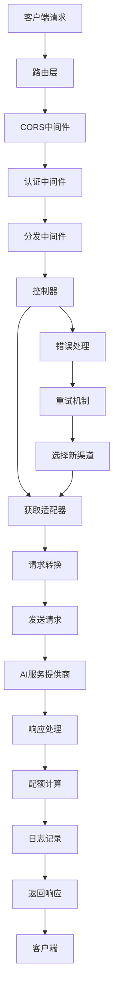

# One API 大模型请求处理流程分析报告

## 流程概述

One API 作为大模型API聚合服务，其核心功能是接收客户端的大模型请求，并将其转发给相应的AI服务提供商。整个流程涉及请求认证、权限验证、渠道选择、请求转换、响应处理等多个环节。

## 请求处理整体流程

```
客户端请求 → 路由层 → 中间件链 → 控制器 → 适配器 → AI服务商 → 响应处理 → 客户端
```

## 详细流程分析

### 1. 请求接入层

#### 路由配置

```go
func SetRelayRouter(router *gin.Engine) {
    router.Use(middleware.CORS())
    router.Use(middleware.GzipDecodeMiddleware())
    
    // 模型列表接口
    modelsRouter := router.Group("/v1/models")
    modelsRouter.Use(middleware.TokenAuth())
    {
        modelsRouter.GET("", controller.ListModels)
        modelsRouter.GET("/:model", controller.RetrieveModel)
    }
    
    // 主要API接口
    relayV1Router := router.Group("/v1")
    relayV1Router.Use(middleware.RelayPanicRecover(), middleware.TokenAuth(), middleware.Distribute())
    {
        relayV1Router.POST("/chat/completions", controller.Relay)
        relayV1Router.POST("/completions", controller.Relay)
        relayV1Router.POST("/embeddings", controller.Relay)
        relayV1Router.POST("/images/generations", controller.Relay)
        relayV1Router.POST("/audio/transcriptions", controller.Relay)
        relayV1Router.POST("/audio/translations", controller.Relay)
        relayV1Router.POST("/audio/speech", controller.Relay)
        relayV1Router.POST("/moderations", controller.Relay)
        // ... 其他接口
    }
}
```

**支持的API接口**:
- `/v1/chat/completions`: 聊天完成
- `/v1/completions`: 文本完成
- `/v1/embeddings`: 向量嵌入
- `/v1/images/generations`: 图像生成
- `/v1/audio/*`: 音频处理
- `/v1/moderations`: 内容审核

### 2. 中间件处理链

#### 2.1 认证中间件 (TokenAuth)

```go
func TokenAuth() func(c *gin.Context) {
    return func(c *gin.Context) {
        ctx := c.Request.Context()
        key := c.Request.Header.Get("Authorization")
        key = strings.TrimPrefix(key, "Bearer ")
        key = strings.TrimPrefix(key, "sk-")
        
        // 解析令牌
        parts := strings.Split(key, "-")
        key = parts[0]
        
        // 验证令牌
        token, err := model.ValidateUserToken(key)
        if err != nil {
            abortWithMessage(c, http.StatusUnauthorized, err.Error())
            return
        }
        
        // 检查IP限制
        if token.Subnet != nil && *token.Subnet != "" {
            if !network.IsIpInSubnets(ctx, c.ClientIP(), *token.Subnet) {
                abortWithMessage(c, http.StatusForbidden, "IP限制")
                return
            }
        }
        
        // 检查用户状态
        userEnabled, err := model.CacheIsUserEnabled(token.UserId)
        if err != nil || !userEnabled {
            abortWithMessage(c, http.StatusForbidden, "用户已被封禁")
            return
        }
        
        // 获取请求模型
        requestModel, err := getRequestModel(c)
        if err != nil && shouldCheckModel(c) {
            abortWithMessage(c, http.StatusBadRequest, err.Error())
            return
        }
        
        // 检查模型权限
        if token.Models != nil && *token.Models != "" {
            if requestModel != "" && !isModelInList(requestModel, *token.Models) {
                abortWithMessage(c, http.StatusForbidden, "令牌无权使用该模型")
                return
            }
        }
        
        // 设置上下文
        c.Set(ctxkey.Id, token.UserId)
        c.Set(ctxkey.TokenId, token.Id)
        c.Set(ctxkey.TokenName, token.Name)
        c.Set(ctxkey.RequestModel, requestModel)
        
        // 管理员可指定渠道
        if len(parts) > 1 && model.IsAdmin(token.UserId) {
            c.Set(ctxkey.SpecificChannelId, parts[1])
        }
        
        c.Next()
    }
}
```

**认证流程**:
1. 提取Authorization头部的Bearer Token
2. 解析令牌格式 (支持 `sk-xxx` 和 `sk-xxx-channelid` 格式)
3. 验证令牌有效性和状态
4. 检查IP/子网限制
5. 验证用户状态
6. 检查模型权限
7. 设置请求上下文

#### 2.2 分发中间件 (Distribute)

```go
func Distribute() func(c *gin.Context) {
    return func(c *gin.Context) {
        ctx := c.Request.Context()
        userId := c.GetInt(ctxkey.Id)
        
        // 获取用户组
        userGroup, _ := model.CacheGetUserGroup(userId)
        c.Set(ctxkey.Group, userGroup)
        
        var requestModel string
        var channel *model.Channel
        
        // 检查是否指定渠道
        channelId, ok := c.Get(ctxkey.SpecificChannelId)
        if ok {
            // 使用指定渠道
            id, err := strconv.Atoi(channelId.(string))
            if err != nil {
                abortWithMessage(c, http.StatusBadRequest, "无效的渠道ID")
                return
            }
            
            channel, err = model.GetChannelById(id, true)
            if err != nil {
                abortWithMessage(c, http.StatusBadRequest, "无效的渠道ID")
                return
            }
            
            if channel.Status != model.ChannelStatusEnabled {
                abortWithMessage(c, http.StatusForbidden, "该渠道已被禁用")
                return
            }
        } else {
            // 自动选择渠道
            requestModel = c.GetString(ctxkey.RequestModel)
            var err error
            channel, err = model.CacheGetRandomSatisfiedChannel(userGroup, requestModel, false)
            if err != nil {
                message := fmt.Sprintf("当前分组 %s 下对于模型 %s 无可用渠道", userGroup, requestModel)
                abortWithMessage(c, http.StatusServiceUnavailable, message)
                return
            }
        }
        
        logger.Debugf(ctx, "user id %d, user group: %s, request model: %s, using channel #%d", 
                     userId, userGroup, requestModel, channel.Id)
        
        // 设置渠道上下文
        SetupContextForSelectedChannel(c, channel, requestModel)
        c.Next()
    }
}
```

**分发流程**:
1. 获取用户组信息
2. 检查是否指定特定渠道
3. 如果未指定，根据用户组和请求模型自动选择可用渠道
4. 验证渠道状态
5. 设置渠道相关上下文信息

#### 2.3 渠道上下文设置

```go
func SetupContextForSelectedChannel(c *gin.Context, channel *model.Channel, modelName string) {
    c.Set(ctxkey.Channel, channel.Type)
    c.Set(ctxkey.ChannelId, channel.Id)
    c.Set(ctxkey.ChannelName, channel.Name)
    c.Set(ctxkey.ModelMapping, channel.GetModelMapping())
    c.Set(ctxkey.OriginalModel, modelName)
    c.Set(ctxkey.BaseURL, channel.GetBaseURL())
    c.Set(ctxkey.APIKey, channel.Key)
    c.Set(ctxkey.SystemPrompt, channel.SystemPrompt)
    
    cfg, err := channel.LoadConfig()
    if err != nil {
        logger.SysError("failed to load channel config: " + err.Error())
    } else {
        c.Set(ctxkey.Config, cfg)
    }
}
```

### 3. 请求处理控制器

#### 3.1 主要控制器入口

```go
func Relay(c *gin.Context) {
    ctx := c.Request.Context()
    relayMode := relaymode.GetByPath(c.Request.URL.Path)
    
    if config.DebugEnabled {
        requestBody, _ := common.GetRequestBody(c)
        logger.Debugf(ctx, "request body: %s", string(requestBody))
    }
    
    channelId := c.GetInt(ctxkey.ChannelId)
    userId := c.GetInt(ctxkey.Id)
    
    // 处理请求
    bizErr := relayHelper(c, relayMode)
    if bizErr == nil {
        monitor.Emit(channelId, true)
        return
    }
    
    // 错误处理和重试
    lastFailedChannelId := channelId
    channelName := c.GetString(ctxkey.ChannelName)
    group := c.GetString(ctxkey.Group)
    originalModel := c.GetString(ctxkey.OriginalModel)
    
    go processChannelRelayError(ctx, userId, channelId, channelName, *bizErr)
    
    requestId := c.GetString(helper.RequestIdKey)
    retryTimes := config.RetryTimes
    
    if !shouldRetry(c, bizErr.StatusCode) {
        logger.Errorf(ctx, "relay error happen, status code is %d, won't retry", bizErr.StatusCode)
        retryTimes = 0
    }
    
    // 重试逻辑
    for i := retryTimes; i > 0; i-- {
        channel, err := model.CacheGetRandomSatisfiedChannel(group, originalModel, i != retryTimes)
        if err != nil {
            logger.Errorf(ctx, "CacheGetRandomSatisfiedChannel failed: %+v", err)
            break
        }
        
        logger.Infof(ctx, "using channel #%d to retry (remain times %d)", channel.Id, i)
        
        if channel.Id == lastFailedChannelId {
            continue
        }
        
        middleware.SetupContextForSelectedChannel(c, channel, originalModel)
        requestBody, err := common.GetRequestBody(c)
        c.Request.Body = io.NopCloser(bytes.NewBuffer(requestBody))
        
        bizErr = relayHelper(c, relayMode)
        if bizErr == nil {
            return
        }
        
        channelId := c.GetInt(ctxkey.ChannelId)
        lastFailedChannelId = channelId
        channelName := c.GetString(ctxkey.ChannelName)
        go processChannelRelayError(ctx, userId, channelId, channelName, *bizErr)
    }
}
```

**控制器流程**:
1. 确定请求类型（聊天完成、文本完成、图像生成等）
2. 调用对应的处理函数
3. 如果失败，进行错误处理和重试
4. 记录监控指标

#### 3.2 文本请求处理

```go
func RelayTextHelper(c *gin.Context) *model.ErrorWithStatusCode {
    ctx := c.Request.Context()
    meta := meta.GetByContext(c)
    
    // 获取和验证请求
    textRequest, err := getAndValidateTextRequest(c, meta.Mode)
    if err != nil {
        logger.Errorf(ctx, "getAndValidateTextRequest failed: %s", err.Error())
        return openai.ErrorWrapper(err, "invalid_text_request", http.StatusBadRequest)
    }
    meta.IsStream = textRequest.Stream
    
    // 模型名称映射
    meta.OriginModelName = textRequest.Model
    textRequest.Model, _ = getMappedModelName(textRequest.Model, meta.ModelMapping)
    meta.ActualModelName = textRequest.Model
    
    // 设置系统提示词
    systemPromptReset := setSystemPrompt(ctx, textRequest, meta.ForcedSystemPrompt)
    
    // 获取计费比例
    modelRatio := billingratio.GetModelRatio(textRequest.Model, meta.ChannelType)
    groupRatio := billingratio.GetGroupRatio(meta.Group)
    ratio := modelRatio * groupRatio
    
    // 预消费配额
    promptTokens := getPromptTokens(textRequest, meta.Mode)
    meta.PromptTokens = promptTokens
    preConsumedQuota, bizErr := preConsumeQuota(ctx, textRequest, promptTokens, ratio, meta)
    if bizErr != nil {
        logger.Warnf(ctx, "preConsumeQuota failed: %+v", *bizErr)
        return bizErr
    }
    
    // 获取适配器
    adaptor := relay.GetAdaptor(meta.APIType)
    if adaptor == nil {
        return openai.ErrorWrapper(fmt.Errorf("invalid api type: %d", meta.APIType), 
                                  "invalid_api_type", http.StatusBadRequest)
    }
    adaptor.Init(meta)
    
    // 获取请求体
    requestBody, err := getRequestBody(c, meta, textRequest, adaptor)
    if err != nil {
        return openai.ErrorWrapper(err, "convert_request_failed", http.StatusInternalServerError)
    }
    
    // 发送请求
    resp, err := adaptor.DoRequest(c, meta, requestBody)
    if err != nil {
        logger.Errorf(ctx, "DoRequest failed: %s", err.Error())
        return openai.ErrorWrapper(err, "do_request_failed", http.StatusInternalServerError)
    }
    
    // 检查错误
    if isErrorHappened(meta, resp) {
        billing.ReturnPreConsumedQuota(ctx, preConsumedQuota, meta.TokenId)
        return RelayErrorHandler(resp)
    }
    
    // 处理响应
    usage, respErr := adaptor.DoResponse(c, resp, meta)
    if respErr != nil {
        logger.Errorf(ctx, "respErr is not nil: %+v", respErr)
        billing.ReturnPreConsumedQuota(ctx, preConsumedQuota, meta.TokenId)
        return respErr
    }
    
    // 后消费配额
    go postConsumeQuota(ctx, usage, meta, textRequest, ratio, preConsumedQuota, 
                       modelRatio, groupRatio, systemPromptReset)
    return nil
}
```

**文本请求处理流程**:
1. 解析和验证请求参数
2. 进行模型名称映射
3. 设置系统提示词
4. 计算计费比例
5. 预消费用户配额
6. 获取对应的适配器
7. 转换请求格式
8. 发送到目标AI服务
9. 处理响应
10. 后消费配额和记录日志

### 4. 适配器系统

#### 4.1 适配器接口定义

```go
type Adaptor interface {
    Init(meta *meta.Meta)
    GetRequestURL(meta *meta.Meta) (string, error)
    SetupRequestHeader(c *gin.Context, req *http.Request, meta *meta.Meta) error
    ConvertRequest(c *gin.Context, relayMode int, request *model.GeneralOpenAIRequest) (any, error)
    DoRequest(c *gin.Context, meta *meta.Meta, requestBody io.Reader) (*http.Response, error)
    DoResponse(c *gin.Context, resp *http.Response, meta *meta.Meta) (usage *model.Usage, err *model.ErrorWithStatusCode)
    GetModelList() []string
    GetChannelName() string
}
```

#### 4.2 适配器工厂

```go
func GetAdaptor(apiType int) adaptor.Adaptor {
    switch apiType {
    case apitype.OpenAI:
        return &openai.Adaptor{}
    case apitype.Anthropic:
        return &anthropic.Adaptor{}
    case apitype.Zhipu:
        return &zhipu.Adaptor{}
    case apitype.Ali:
        return &ali.Adaptor{}
    case apitype.Baidu:
        return &baidu.Adaptor{}
    case apitype.Gemini:
        return &gemini.Adaptor{}
    case apitype.AwsClaude:
        return &aws.Adaptor{}
    case apitype.Xunfei:
        return &xunfei.Adaptor{}
    case apitype.Tencent:
        return &tencent.Adaptor{}
    case apitype.Replicate:
        return &replicate.Adaptor{}
    case apitype.Cloudflare:
        return &cloudflare.Adaptor{}
    case apitype.Cohere:
        return &cohere.Adaptor{}
    // ... 更多适配器
    default:
        return nil
    }
}
```

#### 4.3 OpenAI适配器示例

```go
type Adaptor struct {
    meta *meta.Meta
}

func (a *Adaptor) Init(meta *meta.Meta) {
    a.meta = meta
}

func (a *Adaptor) GetRequestURL(meta *meta.Meta) (string, error) {
    return GetFullRequestURL(meta.BaseURL, meta.RequestURLPath, meta.ChannelType), nil
}

func (a *Adaptor) SetupRequestHeader(c *gin.Context, req *http.Request, meta *meta.Meta) error {
    SetupCommonRequestHeader(c, req, meta)
    req.Header.Set("Authorization", "Bearer "+meta.APIKey)
    return nil
}

func (a *Adaptor) ConvertRequest(c *gin.Context, relayMode int, request *model.GeneralOpenAIRequest) (any, error) {
    if request == nil {
        return nil, errors.New("request is nil")
    }
    return request, nil
}

func (a *Adaptor) DoRequest(c *gin.Context, meta *meta.Meta, requestBody io.Reader) (*http.Response, error) {
    return DoRequestHelper(a, c, meta, requestBody)
}

func (a *Adaptor) DoResponse(c *gin.Context, resp *http.Response, meta *meta.Meta) (usage *model.Usage, err *model.ErrorWithStatusCode) {
    if meta.IsStream {
        err, usage = StreamHandler(c, resp, meta.Mode)
    } else {
        err, usage = Handler(c, resp, meta.PromptTokens, meta.ActualModelName)
    }
    return
}
```

### 5. 请求转换和发送

#### 5.1 请求转换

不同的AI服务提供商有不同的API格式，适配器负责将标准的OpenAI格式转换为目标服务的格式。

**智谱AI转换示例**:
```go
func ConvertRequest(request model.GeneralOpenAIRequest) *ChatRequest {
    zhipuRequest := ChatRequest{
        Model:    request.Model,
        Messages: request.Messages,
        Stream:   request.Stream,
    }
    
    if request.MaxTokens != 0 {
        zhipuRequest.MaxTokens = request.MaxTokens
    }
    if request.Temperature != nil {
        zhipuRequest.Temperature = *request.Temperature
    }
    if request.TopP != nil {
        zhipuRequest.TopP = *request.TopP
    }
    
    return &zhipuRequest
}
```

**百度文心转换示例**:
```go
func ConvertRequest(request model.GeneralOpenAIRequest) *ChatRequest {
    baiduRequest := ChatRequest{
        Messages: make([]Message, 0, len(request.Messages)),
        Stream:   request.Stream,
    }
    
    for _, message := range request.Messages {
        baiduRequest.Messages = append(baiduRequest.Messages, Message{
            Role:    message.Role,
            Content: message.StringContent(),
        })
    }
    
    if request.Temperature != nil {
        baiduRequest.Temperature = *request.Temperature
    }
    if request.TopP != nil {
        baiduRequest.TopP = *request.TopP
    }
    
    return &baiduRequest
}
```

#### 5.2 HTTP请求发送

```go
func DoRequestHelper(adaptor Adaptor, c *gin.Context, meta *meta.Meta, requestBody io.Reader) (*http.Response, error) {
    requestURL, err := adaptor.GetRequestURL(meta)
    if err != nil {
        return nil, err
    }
    
    req, err := http.NewRequest(c.Request.Method, requestURL, requestBody)
    if err != nil {
        return nil, err
    }
    
    err = adaptor.SetupRequestHeader(c, req, meta)
    if err != nil {
        return nil, err
    }
    
    // 设置超时
    if config.RelayTimeout > 0 {
        ctx, cancel := context.WithTimeout(c.Request.Context(), time.Duration(config.RelayTimeout)*time.Second)
        defer cancel()
        req = req.WithContext(ctx)
    }
    
    resp, err := client.HTTPClient.Do(req)
    if err != nil {
        return nil, err
    }
    
    return resp, nil
}
```

### 6. 响应处理

#### 6.1 流式响应处理

```go
func StreamHandler(c *gin.Context, resp *http.Response, mode int) (*model.ErrorWithStatusCode, *model.Usage) {
    scanner := bufio.NewScanner(resp.Body)
    scanner.Split(bufio.ScanLines)
    
    common.SetEventStreamHeaders(c)
    
    var usage model.Usage
    var id string
    var model string
    
    for scanner.Scan() {
        data := scanner.Text()
        if len(data) < 6 {
            continue
        }
        
        if data[:6] == "data: " {
            data = data[6:]
        }
        
        if data == "[DONE]" {
            render.Done(c)
            break
        }
        
        var textResponse ChatCompletionsStreamResponse
        err := json.Unmarshal([]byte(data), &textResponse)
        if err != nil {
            logger.SysError("error unmarshalling stream response: " + err.Error())
            continue
        }
        
        if textResponse.Usage != nil {
            usage.PromptTokens = textResponse.Usage.PromptTokens
            usage.CompletionTokens = textResponse.Usage.CompletionTokens
            usage.TotalTokens = textResponse.Usage.TotalTokens
        }
        
        render.StringData(c, data)
    }
    
    if err := scanner.Err(); err != nil {
        logger.SysError("error reading stream: " + err.Error())
    }
    
    resp.Body.Close()
    return nil, &usage
}
```

#### 6.2 非流式响应处理

```go
func Handler(c *gin.Context, resp *http.Response, promptTokens int, modelName string) (*model.ErrorWithStatusCode, *model.Usage) {
    var textResponse SlimTextResponse
    responseBody, err := io.ReadAll(resp.Body)
    if err != nil {
        return ErrorWrapper(err, "read_response_body_failed", http.StatusInternalServerError), nil
    }
    
    err = resp.Body.Close()
    if err != nil {
        return ErrorWrapper(err, "close_response_body_failed", http.StatusInternalServerError), nil
    }
    
    err = json.Unmarshal(responseBody, &textResponse)
    if err != nil {
        return ErrorWrapper(err, "unmarshal_response_body_failed", http.StatusInternalServerError), nil
    }
    
    if textResponse.Error.Type != "" {
        return &model.ErrorWithStatusCode{
            Error:      textResponse.Error,
            StatusCode: resp.StatusCode,
        }, nil
    }
    
    // 复制响应头
    for k, v := range resp.Header {
        c.Writer.Header().Set(k, v[0])
    }
    c.Writer.WriteHeader(resp.StatusCode)
    
    _, err = c.Writer.Write(responseBody)
    if err != nil {
        return ErrorWrapper(err, "copy_response_body_failed", http.StatusInternalServerError), nil
    }
    
    return nil, &textResponse.Usage
}
```

### 7. 计费和配额管理

#### 7.1 预消费配额

```go
func preConsumeQuota(ctx context.Context, textRequest *model.GeneralOpenAIRequest, promptTokens int, ratio float64, meta *meta.Meta) (int64, *model.ErrorWithStatusCode) {
    // 计算预消费配额
    preConsumedQuota := int64(float64(promptTokens) * ratio)
    if preConsumedQuota == 0 {
        preConsumedQuota = 1
    }
    
    // 检查用户配额
    userQuota, err := model.CacheGetUserQuota(ctx, meta.UserId)
    if err != nil {
        return 0, openai.ErrorWrapper(err, "get_user_quota_failed", http.StatusInternalServerError)
    }
    
    if userQuota < preConsumedQuota {
        return 0, openai.ErrorWrapper(errors.New("user quota is not enough"), "insufficient_user_quota", http.StatusForbidden)
    }
    
    // 预消费令牌配额
    err = model.PreConsumeTokenQuota(meta.TokenId, preConsumedQuota)
    if err != nil {
        return 0, openai.ErrorWrapper(err, "pre_consume_token_quota_failed", http.StatusForbidden)
    }
    
    return preConsumedQuota, nil
}
```

#### 7.2 后消费配额

```go
func postConsumeQuota(ctx context.Context, usage *model.Usage, meta *meta.Meta, textRequest *model.GeneralOpenAIRequest, ratio float64, preConsumedQuota int64, modelRatio float64, groupRatio float64, systemPromptReset bool) {
    if usage == nil {
        return
    }
    
    // 计算实际消费
    quota := int64(float64(usage.TotalTokens) * ratio)
    if quota == 0 {
        quota = 1
    }
    
    // 退回多余的预消费配额
    if quota < preConsumedQuota {
        err := model.PostConsumeTokenQuota(meta.TokenId, preConsumedQuota-quota)
        if err != nil {
            logger.Error(ctx, "error return pre-consumed quota: "+err.Error())
        }
    } else if quota > preConsumedQuota {
        // 额外消费
        err := model.PostConsumeTokenQuota(meta.TokenId, quota-preConsumedQuota)
        if err != nil {
            logger.Error(ctx, "error post-consume quota: "+err.Error())
        }
    }
    
    // 记录消费日志
    logContent := fmt.Sprintf("模型 %s，用户 %s，", textRequest.Model, meta.TokenName)
    if usage.CompletionTokens == 0 {
        logContent += fmt.Sprintf("提示令牌 %d，", usage.PromptTokens)
    } else {
        logContent += fmt.Sprintf("提示令牌 %d，完成令牌 %d，", usage.PromptTokens, usage.CompletionTokens)
    }
    logContent += fmt.Sprintf("配额 %d", quota)
    
    model.RecordConsumeLog(ctx, &model.Log{
        UserId:            meta.UserId,
        ChannelId:         meta.ChannelId,
        TokenName:         meta.TokenName,
        ModelName:         textRequest.Model,
        Quota:             int(quota),
        PromptTokens:      usage.PromptTokens,
        CompletionTokens:  usage.CompletionTokens,
        Content:           logContent,
        IsStream:          meta.IsStream,
        SystemPromptReset: systemPromptReset,
    })
}
```

### 8. 错误处理和重试机制

#### 8.1 错误处理

```go
func RelayErrorHandler(resp *http.Response) *model.ErrorWithStatusCode {
    errorResponse := &model.ErrorWithStatusCode{
        StatusCode: resp.StatusCode,
    }
    
    responseBody, err := io.ReadAll(resp.Body)
    if err != nil {
        errorResponse.Error = model.Error{
            Message: "read response body failed",
            Type:    "one_api_error",
        }
        return errorResponse
    }
    
    err = json.Unmarshal(responseBody, &errorResponse.Error)
    if err != nil {
        errorResponse.Error = model.Error{
            Message: string(responseBody),
            Type:    "upstream_error",
        }
    }
    
    return errorResponse
}
```

#### 8.2 重试机制

```go
func shouldRetry(c *gin.Context, statusCode int) bool {
    if statusCode == http.StatusTooManyRequests {
        return true
    }
    if statusCode >= http.StatusInternalServerError {
        return true
    }
    return false
}
```

重试策略：
- 429 (Too Many Requests): 重试
- 5xx (服务器错误): 重试
- 其他错误: 不重试

### 9. 监控和日志

#### 9.1 请求监控

```go
func Emit(channelId int, success bool) {
    if !config.EnableMetric {
        return
    }
    
    if success {
        select {
        case successChan <- channelId:
        default:
            // 通道满了，丢弃
        }
    } else {
        select {
        case failChan <- channelId:
        default:
            // 通道满了，丢弃
        }
    }
}
```

#### 9.2 日志记录

```go
func RecordConsumeLog(ctx context.Context, log *Log) {
    if !config.LogConsumeEnabled {
        return
    }
    log.Username = GetUsernameById(log.UserId)
    log.CreatedAt = helper.GetTimestamp()
    log.Type = LogTypeConsume
    recordLogHelper(ctx, log)
}
```

## 性能优化策略

### 1. 连接池优化

```go
var HTTPClient = &http.Client{
    Timeout: 120 * time.Second,
    Transport: &http.Transport{
        MaxIdleConns:        100,
        MaxIdleConnsPerHost: 20,
        IdleConnTimeout:     90 * time.Second,
        TLSHandshakeTimeout: 10 * time.Second,
    },
}
```

### 2. 缓存优化

- 令牌信息缓存
- 用户组信息缓存
- 渠道信息缓存
- 模型列表缓存

### 3. 异步处理

- 异步记录日志
- 异步更新配额
- 异步发送监控指标

### 4. 负载均衡

- 基于权重的渠道选择
- 优先级调度
- 故障转移

## 流程图



## 总结

One API 的大模型请求处理流程具有以下特点：

1. **统一接口**: 提供标准的OpenAI格式API
2. **多适配器**: 支持多种AI服务提供商
3. **智能路由**: 基于用户组和模型的智能渠道选择
4. **容错机制**: 完善的错误处理和重试机制
5. **性能优化**: 缓存、连接池、异步处理等优化措施
6. **监控完善**: 全链路监控和日志记录
7. **计费精确**: 精确的配额计算和消费记录

整个流程设计合理，具有良好的扩展性和可维护性，能够有效地处理大规模的AI请求。 