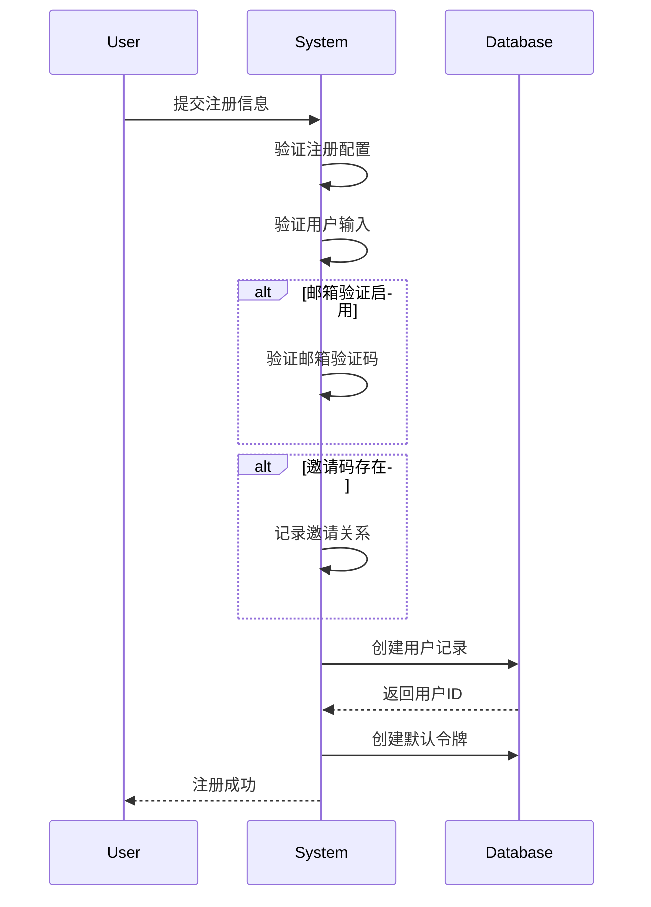
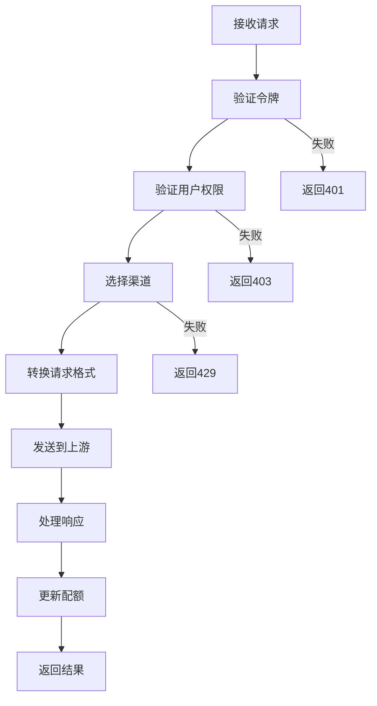

# One API 项目代码工作流程报告

## 项目概述

One API 是一个统一的 AI 服务网关，通过标准的 OpenAI API 格式访问所有主流 AI 大模型服务。项目提供了完整的用户管理、渠道管理、配额控制和监控告警功能，支持 20+ 个 AI 服务提供商，包括 OpenAI、Azure、Google Gemini、Anthropic Claude 等。

## 系统架构

### 核心架构组件

```
┌─────────────────┐    ┌──────────────────┐    ┌─────────────────┐
│   前端 Web UI   │────│   API Gateway    │────│   AI Providers  │
│   (React SPA)   │    │   (Gin Server)   │    │   (20+ 服务商)  │
└─────────────────┘    └──────────────────┘    └─────────────────┘
                                │
                       ┌──────────────────┐
                       │   数据存储层     │
                       │ MySQL/PostgreSQL │
                       │     Redis        │
                       └──────────────────┘
```

### 技术栈
- **后端**: Go 1.20 + Gin Web Framework
- **数据库**: MySQL/PostgreSQL + Redis
- **前端**: React.js (多个主题版本)
- **部署**: Docker + Docker Compose
- **监控**: 内置健康检查和指标收集

## 主要工作流程

### 1. 系统启动流程 (`main.go`)

#### 1.1 初始化阶段
1. **配置加载**
   - 读取环境变量和配置文件
   - 设置日志系统和调试模式
   - 初始化国际化支持

2. **数据库连接**
   - 建立主数据库连接 (`model.InitDB()`)
   - 建立日志数据库连接 (`model.InitLogDB()`)
   - 创建 root 账户（首次启动）

3. **缓存系统**
   - 初始化 Redis 客户端 (`common.InitRedisClient()`)
   - 启用内存缓存（如 Redis 可用）
   - 初始化渠道缓存 (`model.InitChannelCache()`)

#### 1.2 后台服务启动
1. **同步服务**
   - 配置同步：每 600 秒同步一次 (`model.SyncOptions()`)
   - 渠道缓存同步：每 600 秒同步一次 (`model.SyncChannelCache()`)

2. **监控服务**
   - 渠道健康检查（如配置了 `CHANNEL_TEST_FREQUENCY`）
   - 批量更新处理（如启用了 `BATCH_UPDATE_ENABLED`）

#### 1.3 API 服务启动
1. **中间件配置**
   - 请求 ID 生成和追踪
   - 语言检测和国际化
   - 限流和 CORS 处理
   - 会话管理

2. **路由注册**
   - API 路由：用户管理、渠道管理、令牌管理
   - 转发路由：OpenAI 兼容的 AI 服务接口
   - Web 界面路由：管理后台和文档

### 2. 用户注册认证流程

#### 2.1 用户注册 (`controller/user.go:113-185`)



**关键验证规则**:
- 用户名唯一，长度 ≤ 12 字符
- 密码长度 8-20 字符
- 邮箱验证（如启用）
- 邀请奖励自动发放

#### 2.2 用户登录 (`controller/user.go:26-94`)
1. **凭据验证**
   - 检查密码登录是否启用
   - 验证用户名/邮箱和密码
   - 检查用户状态

2. **会话管理**
   - 创建用户会话
   - 存储用户角色和权限
   - 返回清理后的用户信息

### 3. 渠道管理流程

#### 3.1 渠道创建 (`controller/channel.go:77-111`)

**支持的渠道类型**:
- OpenAI 系列 (GPT-3.5, GPT-4, DALL-E)
- Azure OpenAI
- Google Gemini/PaLM2
- Anthropic Claude
- AWS Bedrock
- 百度文心一言
- 阿里通义千问
- 讯飞星火
- 字节跳动豆包
- 以及其他 15+ 个服务商

**创建流程**:
1. **输入验证**
   - 验证渠道名称、类型、密钥等必填字段
   - 验证模型映射配置
   - 验证分组和优先级设置

2. **多密钥处理**
   - 支持批量创建（多行密钥）
   - 为每个密钥创建独立渠道
   - 自动设置创建时间戳

3. **能力注册**
   - 为渠道注册支持的模型能力
   - 建立渠道-模型-分组的映射关系

#### 3.2 渠道健康检查 (`controller/channel-test.go`)

**自动检测机制**:
1. **定期检测**
   - 根据 `CHANNEL_TEST_FREQUENCY` 配置的时间间隔
   - 检测所有启用状态的渠道
   - 发送标准测试请求

2. **响应时间监控**
   - 记录每个渠道的响应时间
   - 与阈值比较，标记异常渠道
   - 生成健康检查报告

3. **自动故障处理**
   - 响应超时的渠道自动禁用
   - 发送管理员通知邮件
   - 从负载均衡池中移除

### 4. API 请求处理流程

#### 4.1 请求路由 (`controller/relay.go:45-103`)



#### 4.2 详细处理步骤

1. **身份验证**
   - 解析 Authorization 头中的 Bearer token
   - 验证令牌状态、过期时间、配额限制
   - 验证 IP 地址限制（如配置）

2. **权限检查**
   - 验证用户状态和黑名单状态
   - 验证令牌对请求模型的访问权限
   - 检查用户分组权限

3. **渠道选择**
   - 根据用户分组和请求模型选择可用渠道
   - 应用优先级和权重算法
   - 排除最近失败的渠道

4. **请求转换**
   - 根据目标渠道转换请求格式
   - 应用模型名称映射
   - 预计算 token 数量
   - 预消费配额

5. **上游请求**
   - 发送转换后的请求到目标服务商
   - 处理流式和非流式响应
   - 记录详细日志

6. **响应处理**
   - 解析响应内容和使用量
   - 更新实际使用配额
   - 处理错误和重试

### 5. 令牌管理流程

#### 5.1 令牌创建 (`controller/token.go`)

**令牌特性**:
- 唯一性：自动生成 UUID 格式密钥
- 可配置：过期时间、配额限制、模型限制
- 安全性：支持 IP 地址白名单
- 灵活性：支持无限制配额模式

**创建流程**:
1. **输入验证**
   - 验证令牌名称长度（≤30字符）
   - 验证子网格式（如提供）
   - 验证模型限制配置

2. **令牌生成**
   - 生成唯一访问密钥
   - 设置创建时间和最后使用时间
   - 配置过期时间和配额限制

3. **关联设置**
   - 关联到创建用户
   - 设置模型访问权限
   - 可选的 IP 地址限制

#### 5.2 令牌使用监控

**使用情况跟踪**:
- 实时配额更新
- 使用历史记录
- 访问 IP 地址记录
- 最后使用时间更新

### 6. 配额管理流程

#### 6.1 计费计算 (`controller/billing.go`)

**计费公式**:
```
费用 = 分组倍率 × 模型倍率 × (提示token数 + 补全token数 × 补全倍率)
```

**关键参数**:
- 补全倍率：GPT-3.5 为 1.33，GPT-4 为 2.0
- 分组倍率：不同用户组可设置不同倍率
- 模型倍率：每个模型独立配置

#### 6.2 配额操作

**消费流程**:
1. **预消费**：请求前预估使用量
2. **实际消费**：根据实际使用量调整
3. **返还机制**：失败时返还预消费配额

**充值方式**:
- 管理员手动充值
- 兑换码兑换
- 邀请奖励
- 新用户初始配额

### 7. 监控告警流程

#### 7.1 系统监控

**监控指标**:
- 渠道可用性：响应时间、成功率
- 系统性能：请求量、响应时间
- 用户使用：配额消耗、异常访问

#### 7.2 告警机制

**告警触发条件**:
- 渠道连续失败次数超过阈值
- 系统异常状态
- 配额异常情况

**通知方式**:
- 邮件通知管理员
- 系统内消息
- 第三方消息推送（集成 Message Pusher）

### 8. 用户邀请和兑换流程

#### 8.1 邀请系统 (`model/user.go:138-147`)

**邀请机制**:
1. **邀请码生成**
   - 自动生成 4 字符唯一邀请码
   - 每个用户一个邀请码
   - 通过 `/api/user/aff` 接口获取

2. **奖励机制**
   - 邀请人奖励：可配置配额
   - 被邀请人奖励：新用户初始额外配额
   - 自动发放，无需人工干预

#### 8.2 兑换码系统 (`controller/redemption.go`)

**兑换码管理**:
1. **批量生成**
   - 管理员可批量创建兑换码
   - 支持自定义配额金额
   - 单次最多生成 100 个

2. **使用流程**
   - 用户通过 `/api/user/topup` 使用兑换码
   - 验证兑换码有效性
   - 应用配额到用户账户
   - 标记兑换码为已使用

## 部署和配置

### 环境变量配置

**关键环境变量**:
- `SQL_DSN`: 数据库连接字符串
- `REDIS_CONN_STRING`: Redis 连接配置
- `SESSION_SECRET`: 会话加密密钥
- `CHANNEL_TEST_FREQUENCY`: 渠道检测频率（分钟）
- `SYNC_FREQUENCY`: 配置同步频率（秒）

### Docker 部署

**快速启动**:
```bash
# SQLite 版本
docker run --name one-api -d --restart always -p 3000:3000 \
  -e TZ=Asia/Shanghai -v /path/to/data:/data justsong/one-api

# MySQL 版本
docker run --name one-api -d --restart always -p 3000:3000 \
  -e SQL_DSN="root:password@tcp(localhost:3306)/oneapi" \
  -e TZ=Asia/Shanghai -v /path/to/data:/data justsong/one-api
```

### 多机部署

**集群配置**:
1. 所有服务器设置相同的 `SESSION_SECRET`
2. 使用共享 MySQL 数据库
3. 从服务器设置 `NODE_TYPE=slave`
4. 启用 Redis 缓存同步
5. 可选：设置 `FRONTEND_BASE_URL` 重定向

## 性能优化

### 缓存策略

**多级缓存**:
1. **Redis 缓存**: 令牌验证、用户配额、渠道选择
2. **内存缓存**: 渠道路由表、配置信息
3. **数据库缓存**: 查询结果缓存

**缓存更新机制**:
- 定期同步（可配置频率）
- 写穿模式（数据库更新时同步缓存）
- 延迟加载（按需填充缓存）

### 数据库优化

**连接池配置**:
- 最大空闲连接：`SQL_MAX_IDLE_CONNS` (默认 100)
- 最大打开连接：`SQL_MAX_OPEN_CONNS` (默认 1000)
- 连接生命周期：`SQL_CONN_MAX_LIFETIME` (默认 60 分钟)

**分库分表**:
- 主数据库：用户、渠道、令牌等核心数据
- 日志数据库：请求日志、使用记录等大数据量表

## 安全机制

### 身份验证

**多层验证**:
1. **会话验证**: Web 管理后台
2. **令牌验证**: API 访问
3. **OAuth 验证**: 第三方登录集成

### 权限控制

**角色权限**:
- Root 用户 (100): 完整系统权限
- Admin 用户 (10): 用户和渠道管理
- 普通用户 (1): API 访问权限
- 访客用户 (0): 受限访问

### 安全特性

- **密码安全**: bcrypt 加密存储
- **令牌安全**: UUID 格式随机生成
- **IP 限制**: 令牌级别的 IP 白名单
- **速率限制**: 基于 IP 的请求限流
- **输入验证**: 全面的输入数据验证

## 扩展性设计

### 插件式架构

**适配器模式**:
- 统一的渠道适配器接口
- 支持动态添加新的 AI 服务商
- 标准化的请求/响应转换

### 水平扩展

**扩展策略**:
- 无状态服务设计
- 共享数据库存储
- Redis 集群支持
- 负载均衡部署

## 总结

One API 项目采用现代化的微服务架构设计，通过统一的 API 网关整合多个 AI 服务提供商，提供了完整的用户管理、渠道管理、配额控制和监控告警功能。系统设计充分考虑了扩展性、安全性和性能优化，支持大规模并发访问和多机部署场景。

项目代码结构清晰，模块化程度高，便于维护和扩展。通过详细的配置选项和灵活的策略设置，可以满足不同规模企业的 AI 服务管理需求。